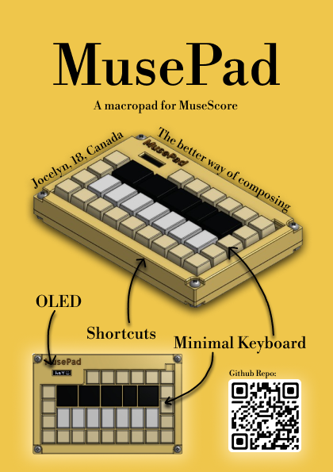
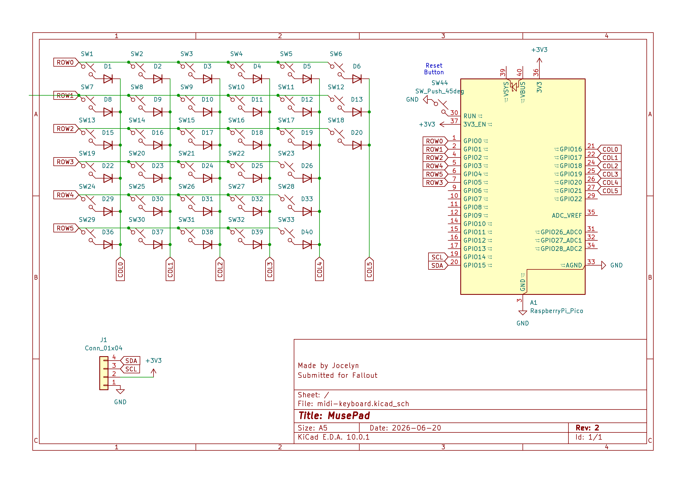
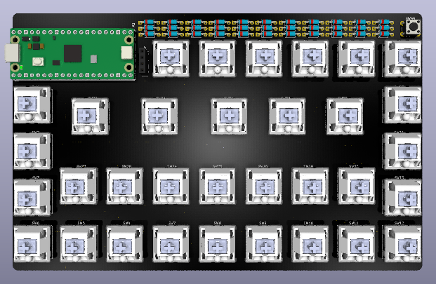
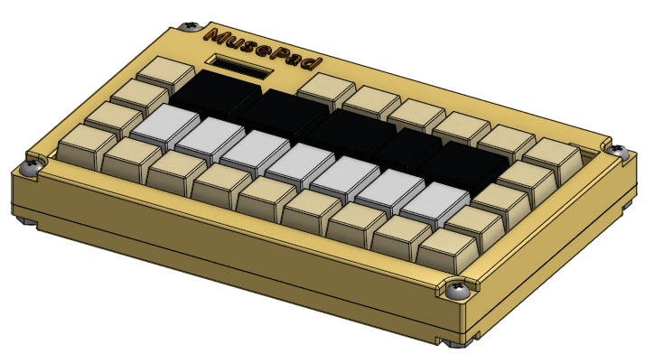

# Musepad
This is a macropad that is built for helping with complicated functions when writing music in MuseScore. This macropad also features a compact and minimalistic design so it looks nice, and a plateless design which uses less material and provides more flex to each individual key.  

  

# User Instructions
Assembly:  
1. print out and buy all the parts found in `MusePad BOM.csv`   
2. solder everything together  
3. put in the keycaps accordingly (please refer to `3d models prints/Full Assembly.step` or reference pictures below for ideal layout)  
4. connect the oled to the pins on the PCB using jumper wires
5. sandwich pcb between the top and the bottom case  

Firmware:  
1. go to [circuitpython.org/downloads](circuitpython.org/downloads)    
2. download circuitpython for raspberry pi pico  
3. plug in keyboard to laptop and make sure to use a data transmitting cable  
4. open up the pico folder in your computer's directory  
5. replace the content of `code.py` in the pico folder with the one in this repo (`root://code/code.py`) 

# Why and how did I make it
I love composing music, and MuseScore is one great free composing software. However, whenever I want to compose efficiently, musescore hinders me significantly. Each detail I add to the music either requires too much shortcut memorization or it would take ages to find so I built MusePad to solve this problem. 

I first came up with some drawings of the design to make sure I knew how the layout kind of looked like. Then I made the schematic and PCB design on keycad, mostly following a tutorial (refer to the first resource link). I made the CAD on onshape mostly using skills I already had based on my past experiences, and for details that I don't really know, I referenced the hackpad guide (link no.2 in resource section). I also learned how to cad a keycap following a youtube tutorial (link no.3) which was really interesting. 

# Diagrams
Schematic Diagram:  
  
PCB Editor View:  
  
PCB Model:  
  
Assembled Model:  
  

# Resources
1. the   
2.   
3. 