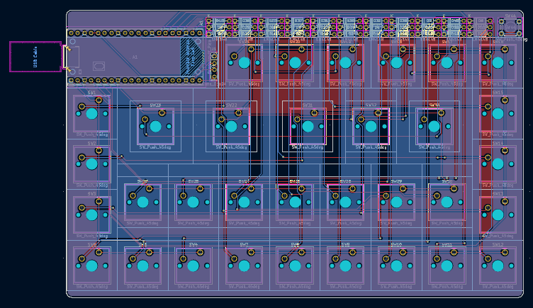

# Musepad
This is a macropad that is built for helping with complicated functions when writing music in MuseScore. This macropad also features a compact and minimalistic design so it looks nice, and a plateless design which uses less material and provides more flex to each individual key.  
[zine]  

# User Instructions
Assembly:  
1. print out and buy all the parts found in `MusePad BOM.csv`   
2. solder everything together  
3. put in the keycaps accordingly (please refer to `3d models prints/Full Assembly.step` or reference pictures below for ideal layout)  
4. sandwich pcb between the top and the bottom case  

Firmware:  
1. go to [circuitpython.org/downloads](circuitpython.org/downloads)    
2. download circuitpython for raspberry pi pico  
3. plug in keyboard to laptop and make sure to use a data transmitting cable  
4. open up the pico folder in your computer's directory  
5. replace the content of `code.py` in the pico folder with the one in this repo (`root://code/code.py`) 

# Why did I make it
I love composing music, and MuseScore is one great free composing software. However, whenever I want to compose efficiently, musescore hinders me significantly. Each detail I add to the music either requires too much shortcut memorization or it would take ages to find so I built MusePad to solve this problem. 

# Diagrams
Schematic Diagram:  
  
PCB Editor View:  
  
3D Model:  
  

# Resources
the blueprint tutorial and youtube